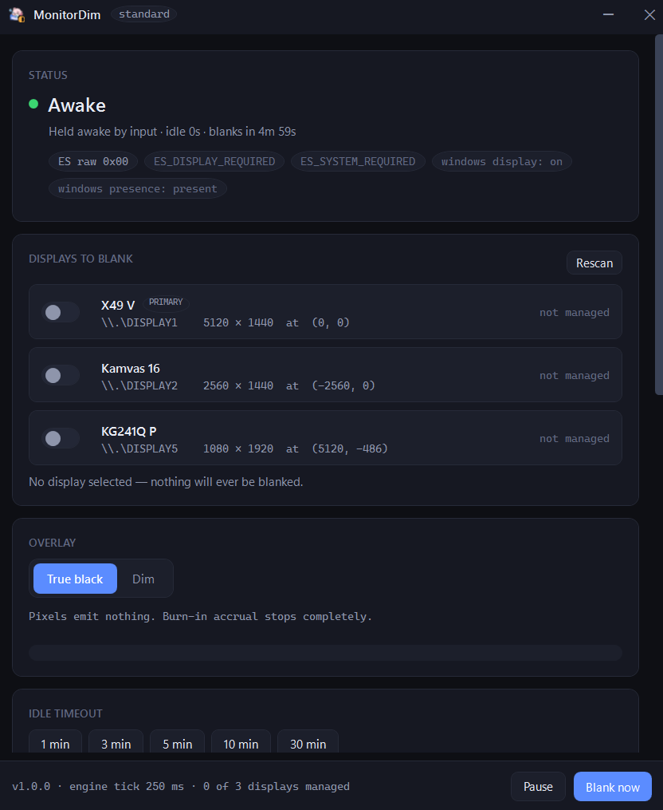

<div align="center">


# MonitorDim

**Get an idle OLED monitor to true black without putting the display to sleep.**

Windows 10/11 · x64 · sits in the tray

</div>

---

This app is built to allow OLED monitors to dim the display when the user is not actively using it without getting the monitor to sleep (by windows). This app allows idle monitors to display in **true black** by emitting nothing with 0 rgb values (black pixels). Windows' only support the feature to *power the display off* — and
a powered-off monitor does not come back instantly. On DisplayPort the link drops entirely,
so Windows sees an unplug: it re-detects your displays, re-trains the link, and shuffles every
window around while you sit there waiting. Microsoft's own name for that is
[Rapid Hot Plug Detect](https://devblogs.microsoft.com/directx/avoid-unexpected-app-rearrangement/).

Essentially, MonitorDim puts a black window over the monitors you pick, and nothing ever gets powered
down — so there's no link drop, no window shuffle, and wake is instant in less than 500ms. It also fixes the
other half of the problem: Windows' "turn off my screen after N minutes" is a single global
switch, and [Microsoft confirms there is no per-monitor
version](https://learn.microsoft.com/en-us/answers/questions/3952711/is-there-a-way-to-prevent-just-only-1-of-monitor-f).
MonitorDim is per-monitor.

- **Your OLED stops burning in** — a black frame means the pixels emit nothing.
- **Nothing gets powered off**, so no link drop, no window shuffle, and wake is instant.
- **Only the monitors you choose.** Leave the one you're watching a movie on alone.
- **It follows Windows' own rules** for what counts as "you're still using this", instead of
  guessing. If Steam or Zoom or a video player is holding your screen awake, MonitorDim
  notices and stays out of the way.

<div align="center">

</div>

---

## Install

Grab `MonitorDim.exe` from [Releases](../../releases) and run it. Single file, no installer,
nothing to unpack — it's self-contained, so you don't need .NET installed.

Or build it yourself:

```powershell
git clone <this repo>
cd MonitorDim
.\tools\publish.ps1        # produces .\publish\MonitorDim.exe
```

Needs the .NET 9 SDK to build. Nothing to install to run.

---

## Using it

It lives in the tray. Double-click the tray icon (or right-click → Settings) for the window
in the screenshot above.

| | |
|---|---|
| **Displays to blank** | Toggle the monitors you want covered. Everything else is left alone. Your picks are stored per physical monitor, so unplugging and replugging doesn't scramble them. |
| **Overlay** | **True black** — fully opaque, pixels emit nothing, burn-in stops. **Dim** — partially see-through at a percentage you pick, so the screen stays readable. Dim only *slows* burn-in; anything under 100% is still emitting light. |
| **Idle timeout** | How long before the picked monitors go black. 1 / 3 / 5 / 10 / 30 min, or type your own. |
| **Status** | Live: whether you're counted as awake, seconds until blanking, and which power requests are currently in force. |
| **Blank now / Pause** | Blank immediately, or switch the whole thing off without quitting. |
| **Start with Windows** | Registry `Run` key. Optionally **Start elevated** instead, which registers a logon task so you get admin from boot with no UAC prompt. |

Blanking clears the instant you touch the keyboard or mouse, or switch windows.

> **Note:** set Windows' own *Turn off my screen after* (Settings → System → Power) to
> something **longer than MonitorDim's idle timeout**, otherwise Windows powers your monitors
> off first and the app never gets a chance. 30 minutes is a good backstop — prefer that over
> `Never`, for the [lock screen](#the-lock-screen) reason below.

---

## Who's holding the display awake

Any app can ask Windows to keep the screen on, and Windows honours it. MonitorDim reads the
same request and honours it too, so it won't blank over your movie. Broadly, the things that
do this are:

- **Video playback** — players and browsers, while something is actually playing
- **Remote desktop and game streaming** — e.g. Parsec
- **Games and launchers** — e.g. Steam
- **Calls, screen sharing and recording** — e.g. Zoom, OBS
- **Background system work** — some services and drivers, which is why the list occasionally
  shows something you've never heard of

This is just a rough guide, not a rule — whether a given app does it is entirely up to the app requesting to keep the display up.

### Checking what's holding it right now

Two places, both live:

- **Settings window → HOLDING THE DISPLAY AWAKE** — a card listing each holder with a
  `PROCESS` / `SERVICE` / `DRIVER` tag and its stated reason. **Refresh** re-queries.
- **Tray menu → Holding display awake** — same list as a submenu, with the count in the
  label, e.g. `Holding display awake  (2)`.

**Seeing the app names requires administrator rights.** That's a Windows restriction, not a
choice here — the data comes from `powercfg /requests`, which is admin-only. What changes
without admin:

| | Standard user | Administrator |
|---|---|---|
| Blanking behaves correctly | ✅ | ✅ |
| "Is *something* holding the display awake?" | ✅ yes/no | ✅ |
| **Which app** is holding it | ❌ | ✅ named list |

The yes/no is all the blanking logic actually needs, so running as a standard user costs you
nothing functionally — only the names. The chip next to the title reads `standard` or
`elevated` so you can tell at a glance which mode you're in.

**To get the names**, either:

1. Click **Restart elevated** in the banner on that card — one UAC prompt, the app relaunches
   with admin and reopens the settings window. Good for a one-off "what the hell is keeping my
   screen on right now".
2. Or turn on **Start elevated (scheduled task)** in the startup section — registers a logon
   task that runs with admin from boot, so you get names permanently with **no UAC prompt**
   every time. Good if you want this always on.

You can also just check it yourself in an admin terminal, without the app:

```powershell
powercfg /requests
```

### Optional extras

- **Never blank during fullscreen games/video** — off by default. Windows doesn't do this,
  but an overlay on top of an exclusive-fullscreen game can misbehave, so it's offered.

---

## Known limits

### The lock screen

**MonitorDim can't touch it.** The Windows lock screen runs on a separate desktop that no
normal app can draw over. Whatever your screens do there is pure Windows, and the only lever
is a power setting — a *different* one from "turn off display after", defaulting to **60
seconds** and hidden from the Power Options UI. More in [TECHNICAL.md](TECHNICAL.md#the-lock-screen-measured).

### Memory

~240 MB working set. Major contribution from WPF and WinForms both being loaded.

---

## Something went wrong

Check `%APPDATA%\MonitorDim\error.log` first. A window that fails to build looks exactly like
"nothing happened" otherwise.

There's also a built-in diagnostic that runs 89 checks against your actual machine — display
enumeration, overlay placement, power-request detection, the lot:

```powershell
MonitorDim.exe --selftest report.txt
```

Exit code 0 means everything passed. If you're filing an issue, attach that file.

---

## Technical notes

How it decides what counts as activity, why the overlay is built the way it is, what was
actually measured on the lock screen, and the traps found along the way:
**[TECHNICAL.md](TECHNICAL.md)**.

## Prior art

[oled_aegis](https://github.com/spenserlee/oled_aegis) (per-monitor overlay + audio-session
media detection) and [OLED-Sleeper](https://github.com/Quorthon13/OLED-Sleeper) (per-monitor
picker, DDC/CI dimming) solve the same problem with input-idle heuristics only. Neither reads
display power requests, which is the piece that makes this match Windows instead of guessing.
